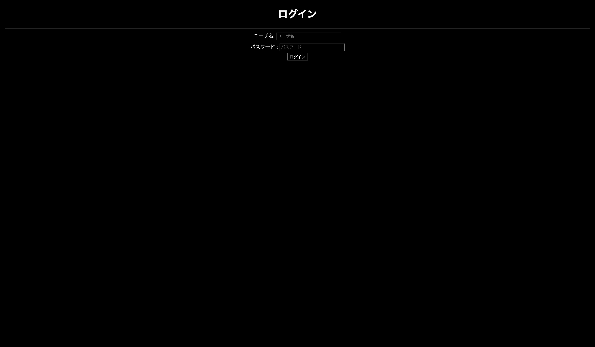
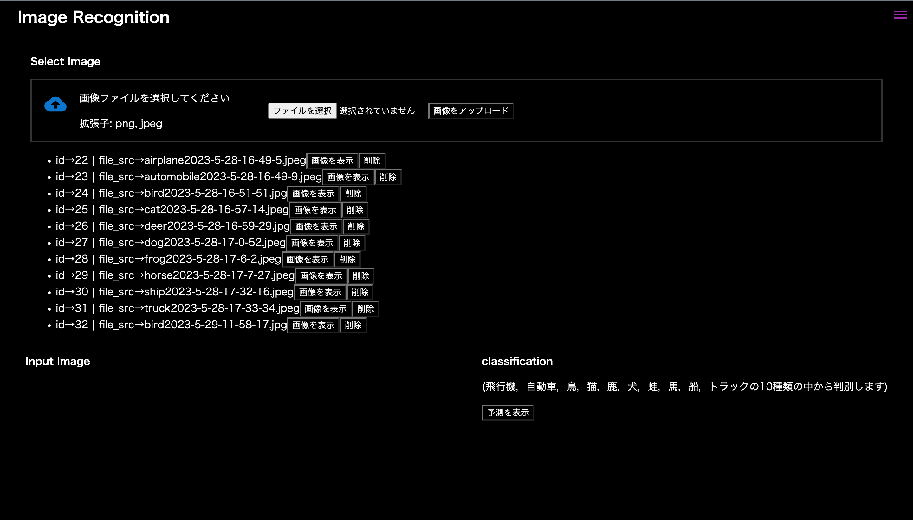
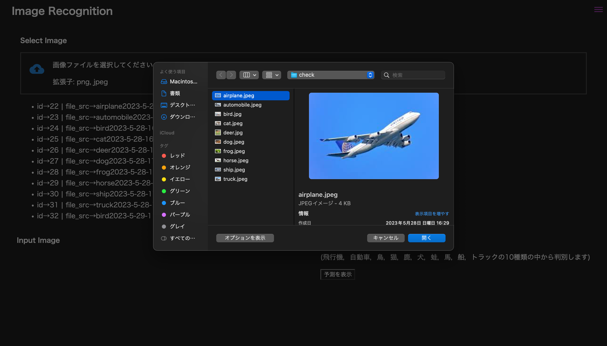
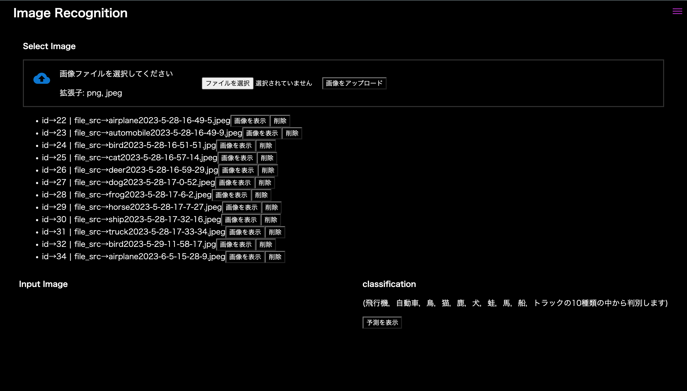
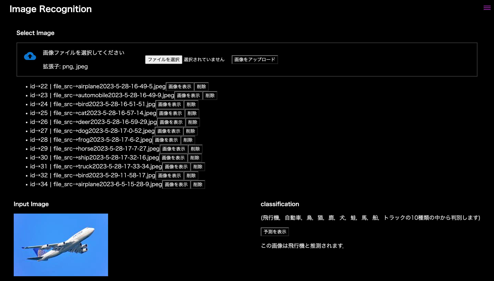

# 使用方法
1\. ログイン画面でユーザ名とパスワードを入力し，「ログイン」ボタンを押下します．

 

2\. 次に，「ファイルを選択」ボタンを押下します．

 

3\. 任意の画像を選択し，「画像をアップロード」ボタンを押下します．

 

4\. 今までに選択した画像一覧の一番下に追加されています．

 

5\. 最後に，「画像を表示」ボタンを押下して，画像を表示し．「予測を表示」ボタンを押下すると，機械学習による画像の予測がテキストで表示されます．

